---
## Front matter
title: "Шаблон отчёта по лабораторной работе"
subtitle: "Первая лабораторная работа"
author: "Аристид Жан Лоэнс Аристобуль"

## Generic otions
lang: ru-RU
toc-title: "Содержание"

## Bibliography
bibliography: bib/cite.bib
csl: pandoc/csl/gost-r-7-0-5-2008-numeric.csl

## Pdf output format
toc: true # Table of contents
toc-depth: 2
lof: true # List of figures
lot: true # List of tables
fontsize: 12pt
linestretch: 1.5
papersize: a4
documentclass: scrreprt
## I18n polyglossia
polyglossia-lang:
  name: russian
  options:
	- spelling=modern
	- babelshorthands=true
polyglossia-otherlangs:
  name: english
## I18n babel
babel-lang: russian
babel-otherlangs: english
## Fonts
mainfont: PT Serif
romanfont: PT Serif
sansfont: PT Sans
monofont: PT Mono
mainfontoptions: Ligatures=TeX
romanfontoptions: Ligatures=TeX
sansfontoptions: Ligatures=TeX,Scale=MatchLowercase
monofontoptions: Scale=MatchLowercase,Scale=0.9
## Biblatex
biblatex: true
biblio-style: "gost-numeric"
biblatexoptions:
  - parentracker=true
  - backend=biber
  - hyperref=auto
  - language=auto
  - autolang=other*
  - citestyle=gost-numeric
## Pandoc-crossref LaTeX customization
figureTitle: "Рис."
tableTitle: "Таблица"
listingTitle: "Листинг"
lofTitle: "Список иллюстраций"
lotTitle: "Список таблиц"
lolTitle: "Листинги"
## Misc options
indent: true
header-includes:
  - \usepackage{indentfirst}
  - \usepackage{float} # keep figures where there are in the text
  - \floatplacement{figure}{H} # keep figures where there are in the text
---

# Цель работы

Знакомство с git Hub и его фундаментальными понятиями.

# Теоретическое введение

B табл. [-@tbl:std-dir] приведено базовые команды Git.

: Описание некоторых команд Git. {#tbl:std-dir}

| Команды | Описание Командов                                                                                                          |
|--------------|----------------------------------------------------------------------------------------------------------------------------|
| `git config`          | Чтобы настроить git в нашем компьютере.                                                                               |
| `git init `      | Чтобы переобразывать каталог в репозытории добавляя файл .git в выбранном каталоге    |
| `git add`       | Чтобы индексировать наши изменение                                           |
| `git commit`      | Чтобы сокранить наши изменение в репозытории |
| `git remote`     | Позваляет просмотрить удаленный из которого наш локальный репозыторый извлечил данный или позволяет уточнить репозыторый к которому собираем отправить файли                                                                                    |
| `git push`      | Чтобы отправить наши измениние в удалённый репозыторый                                                                                |
| `git clone`       | Чтобы клонировать удалённый репозыторый в наш компьютер                                                                                                            |
| `git pull`       | Чтобы клонировать и слиться новые измениние удалённого репозыторый в наш локалный репозыторый                                                                                 |

# Выполнение лабораторной работы

В этом изображении, мы устроим наш git (рис. [-@fig:001]).

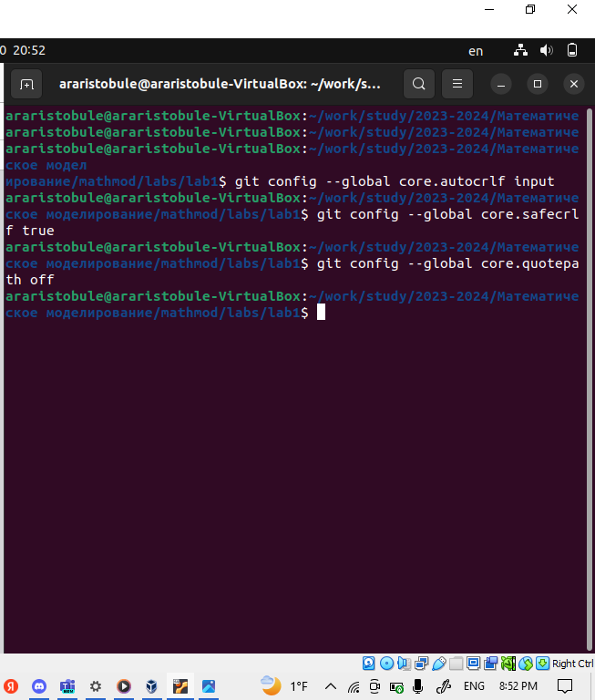{#fig:001 width=70%}

Создание каталога hello и внутри его файл hello которой мы модифировали с помошью команда echo (рис. [-@fig:002]).

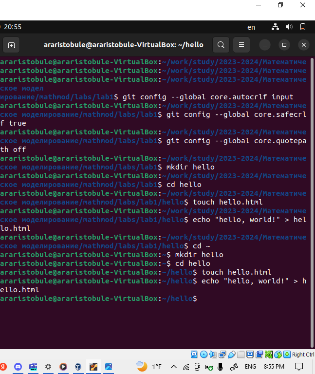{#fig:002 width=70%}

Преобразавание документ hello в репозитории. Первый индексирование и первый коммит (рис. [-@fig:003]).

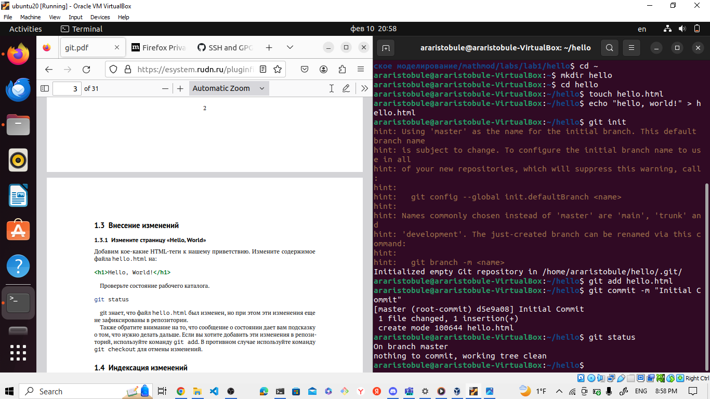{#fig:003 width=70%}

Когда коммит измениние надо писать комментарии с помощью метки -m иначе editor возникается чтобы там уточнить комментари для коммита. (рис. [-@fig:004]).

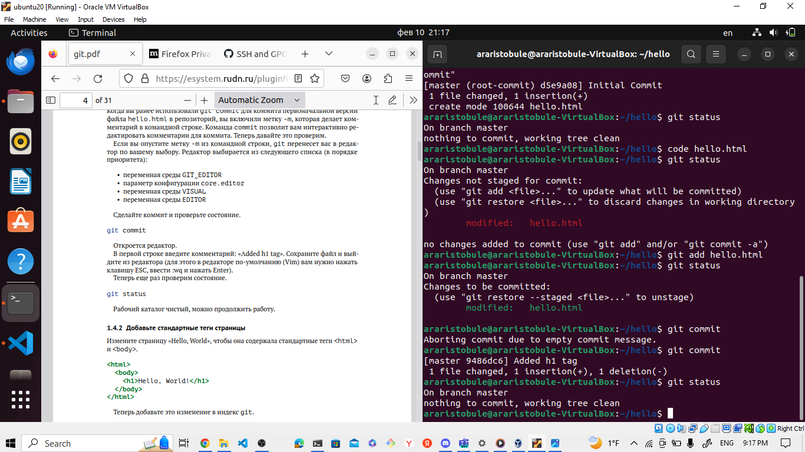{#fig:004 width=70%}

Посмотреть все коммити ваше репозитории с помощью git log (рис. [-@fig:006]).

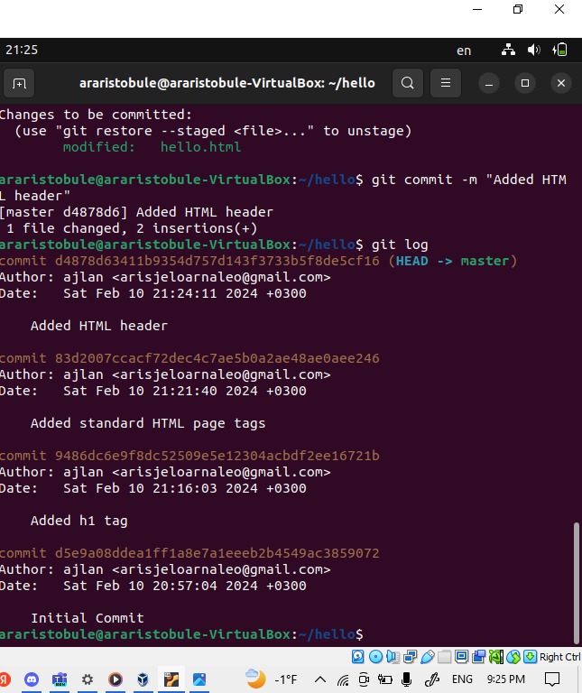{#fig:006 width=70%}

Другой вариант чтобы смотреть списку коммитов с помощью git log --pretty=oneline (рис. [-@fig:007]).

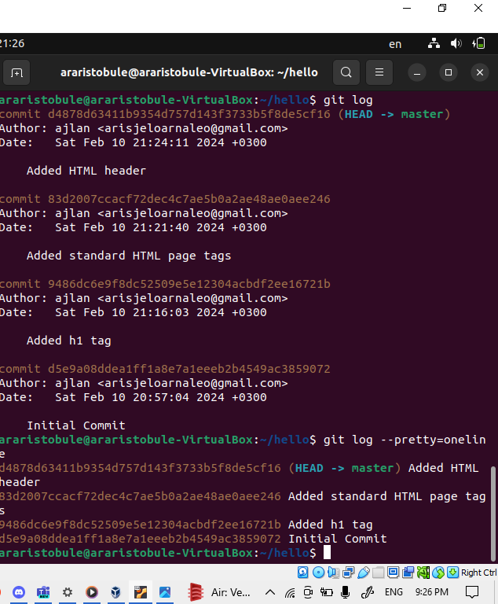{#fig:007 width=70%}

С помощью git checkout <хэш кода>, мы можешь перейти в предыдущый коммит. (рис. [-@fig:008]).

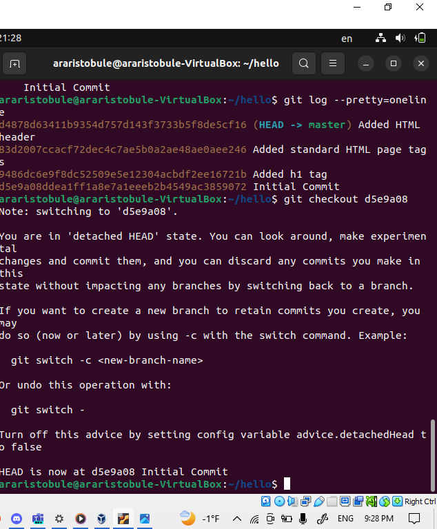{#fig:008 width=70%}

И чтобы потом вернуться на наш последный коммит в ветке master, просто набирать git checkout master (рис. [-@fig:009]).

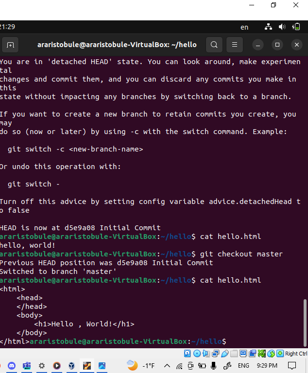{#fig:009 width=70%}

Можно исползовать git tap чтобы называть наши коммити. (рис. [-@fig:010]).

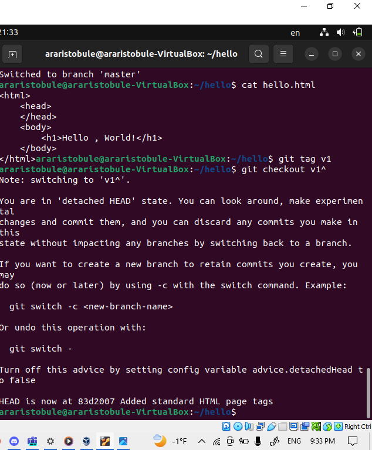{#fig:010 width=70%}

Чтобы сбросить из буфера измениние который не собираешь сократить можно използовать git checkout <имя файла> (рис. [-@fig:011]).

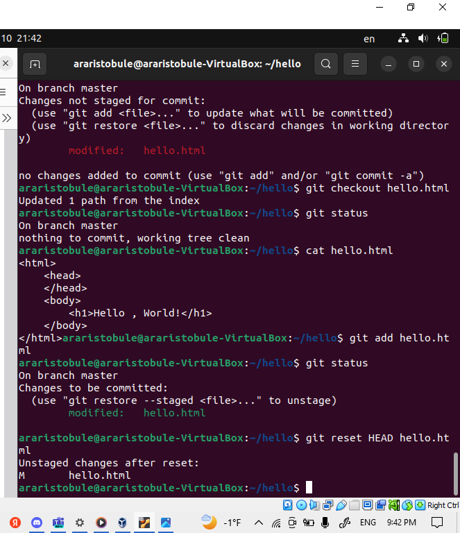{#fig:011 width=70%}

Чтобы сбросить из индексированных файлов измениние который не собираешь сократить можно използовать git reset HEAD <имя файла> (рис. [-@fig:012]).

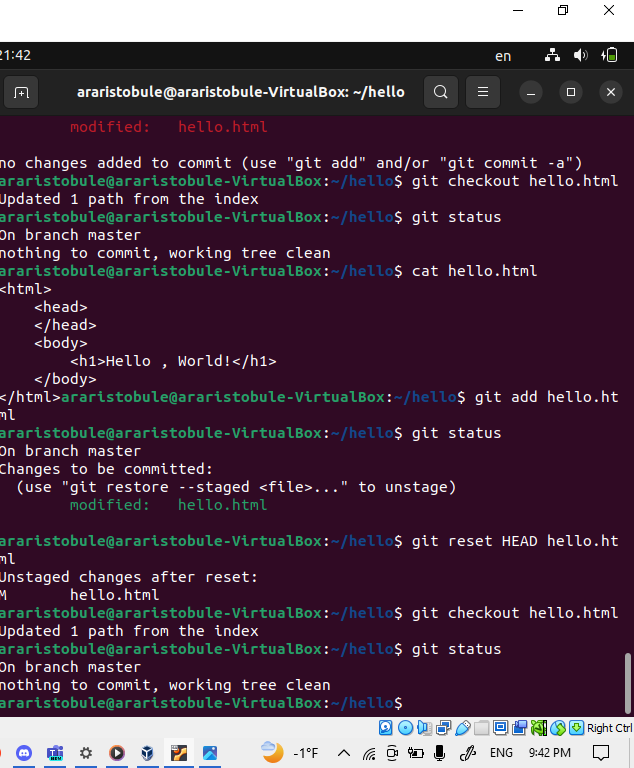{#fig:012 width=70%}

Чтобы модифировать последный коммит можно исползовать git commit --amend (рис. [-@fig:015]).

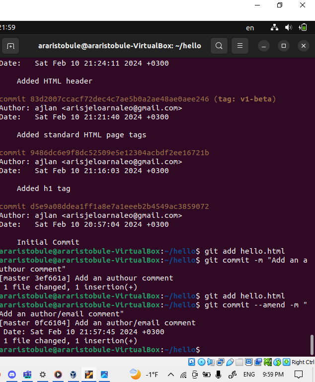{#fig:015 width=70%}

Чтобы переместить файл в репозитории лучше исползовать git mv (рис. [-@fig:017]).

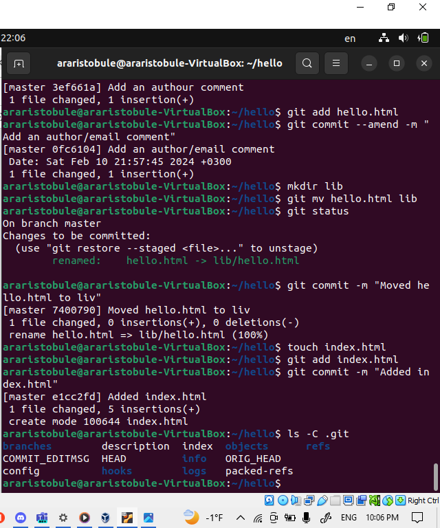{#fig:017 width=70%}

Создание новую ветку style с помощбю git checkout -b style (рис. [-@fig:018]).

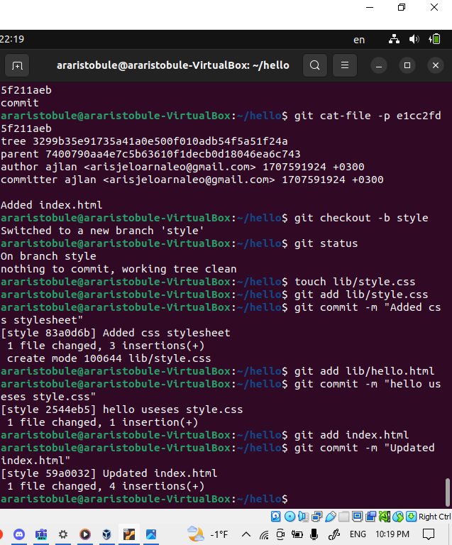{#fig:018 width=70%}

Слияние ветки с помощью git merge и просмотр эти ветки графический с помощью git log --graph --alд (рис. [-@fig:020]).

{#fig:020 width=70%}

Чтобы rebase измениние ветки можно испозовать команды git Rebase (рис. [-@fig:021]).

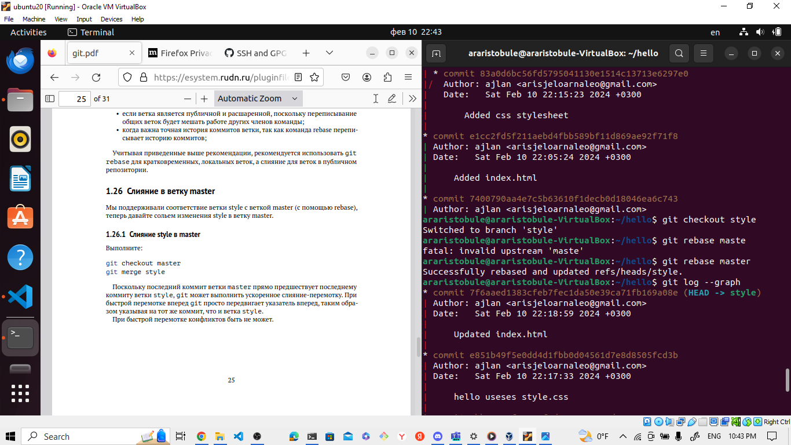{#fig:021 width=70%}

# Выводы

Git Удобно способ чтобы сохранить разные этапы данного проэкта.

