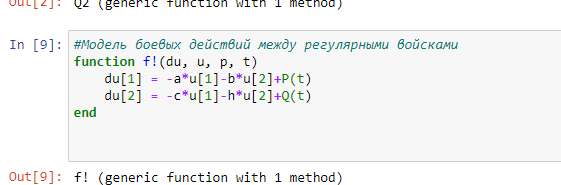
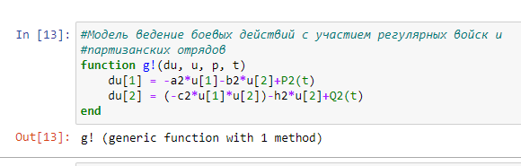
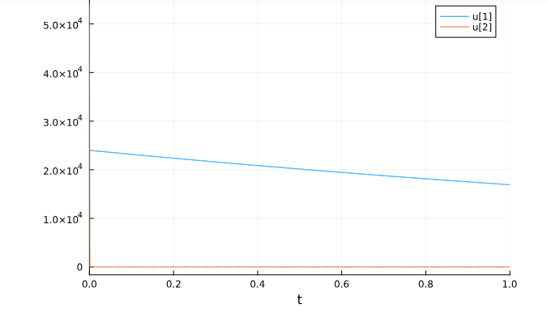

---
## Front matter
lang: ru-RU
title: Presentation of lab work
subtitle: lab 3
author:
  - Aristide Jean Loens Aristobule 
institute:
  - RUDN
  
date: 24 february 2024

## i18n babel
babel-lang: russian
babel-otherlangs: english

## Formatting pdf
toc: false
toc-title: Содержание
slide_level: 2
aspectratio: 169
section-titles: true
theme: metropolis
header-includes:
 - \metroset{progressbar=frametitle,sectionpage=progressbar,numbering=fraction}
 - '\makeatletter'
 - '\beamer@ignorenonframefalse'
 - '\makeatother'
---

# Информация

## Докладчик

:::::::::::::: {.columns align=center}
::: {.column width="70%"}

  * Aristide Jean Loens
  * Student
  * Science Faculty 
  * RUDN
  * [kulyabov-ds@rudn.ru](mailto:kulyabov-ds@rudn.ru)

:::
::: {.column width="30%"}

:::
::::::::::::::

# Introductory

## Goals and tasks

- Modeling troop numbers between rivals using a time function.
- In my assignment, I was asked to build graphs of changes in the number of troops of Army X and Army Y for following cases:
  1. Model of combat operations between regular troops
  2. Model of combat operations with the participation of regular troops and partisan detachments

# Results
## First task 
- We used The library Plots and DifferentialEquations
  {#fig:001 width=70%}

## Second task
- Model of combat operations between regular troops
  {#fig:003 width=70%}

## First graph
  {#fig:004 width=70%}

## Третья задача
- Model of combat operations with the participation of regular troops and partisan detachments
  {#fig:005 width=70%}

## Second graph
  {#fig:006 width=70%}

# Final
- In the first model, it can be noted that Army Country Y won thanks to their numerical superiority, and in the second model, Country Y lost even with their numerical superiority due to the fact that the regular army did not fight.
*Thanks for your attention*

 

