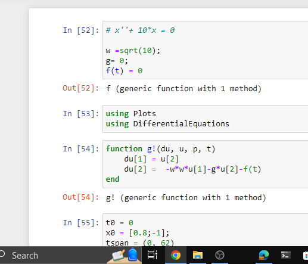
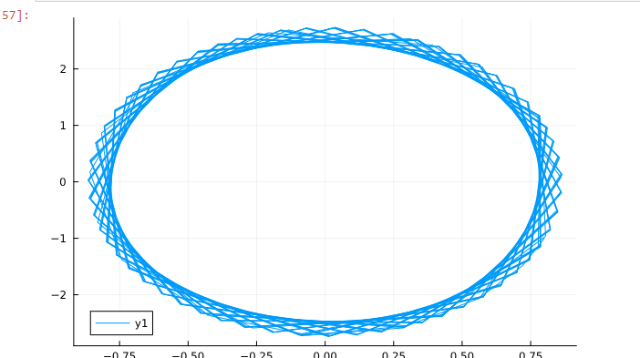
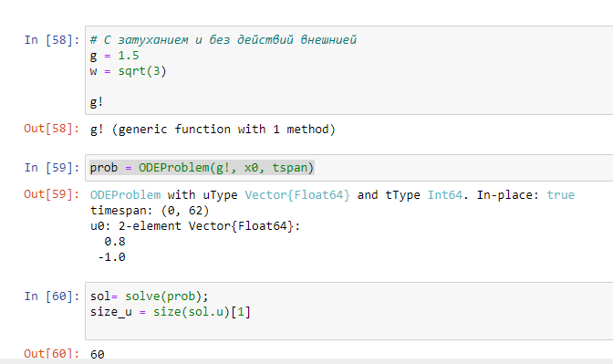
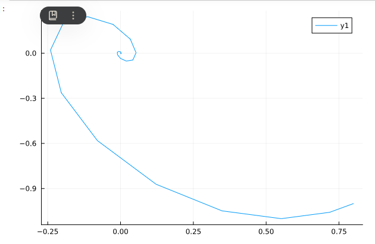
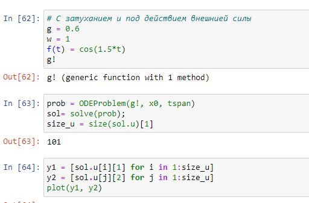
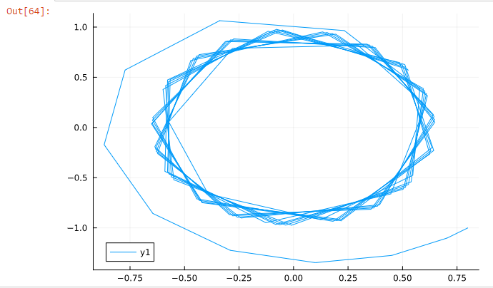

---
## Front matter
lang: ru-RU
title: Презентация лаб 4
subtitle: лаб 4
author:
  - Аристид Жан Лоэнс Аристобуль Надаль
institute:
  - Российский университет дружбы народов, Москва, Россия
date: 01 мая 2024

## i18n babel
babel-lang: russian
babel-otherlangs: english

## Formatting pdf
toc: false
toc-title: Содержание
slide_level: 2
aspectratio: 169
section-titles: true
theme: metropolis
header-includes:
 - \metroset{progressbar=frametitle,sectionpage=progressbar,numbering=fraction}
 - '\makeatletter'
 - '\beamer@ignorenonframefalse'
 - '\makeatother'
---

# Информация

## Докладчик

:::::::::::::: {.columns align=center}
::: {.column width="70%"}

  * Аристид Жан Лоэнс Аристобуль
  * Студент
  * Российский университет дружбы народов

:::
::: {.column width="30%"}

:::
::::::::::::::

# Вводная часть

## Цели и задачи

- Постройте фазовый портрет гармонического осциллятора и решение уравнения 
гармонического осциллятора в разных случаев.

# Результаты

## Первый Случай
В этом рисунке написаны параметры дифф. уравнение гармонического осциллятора без затухании и без действия внешней силы. И написано тоже функция моделирующая такой случай. (рис. [-@fig:001]).

{#fig:001 width=70%}

## График

График соотвествует первому случай (рис. [-@fig:002]).

{#fig:002 width=70%}

## Второй Случай 
В этом рисунке написаны параметры дифф. уравнение гармонического осциллятора c затуханием и без действия внешней силы. И написано тоже функция моделирующая такой случай (рис. [-@fig:003]).

{#fig:003 width=70%}

## График

График соотвествует второму случай (рис. [-@fig:004]).

{#fig:004 width=70%}

## Третьий Случай

В этом рисунке написаны параметры дифф. уравнение гармонического осциллятора c затуханием и под действием внешней силы. И написано тоже функция моделирующая такой случай (рис. [-@fig:005]).

{#fig:005 width=70%}

## График

График соотвествует третьему случай (рис. [-@fig:006]).

{#fig:006 width=70%}

# Итоговый слайд

В первом случай когда у нас нет потера энергия в плоскости xy оциллиатор рисует траектория который безконечно повторится.

