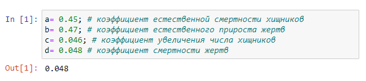
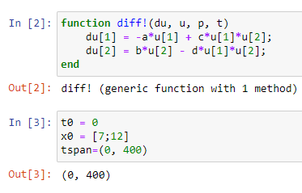
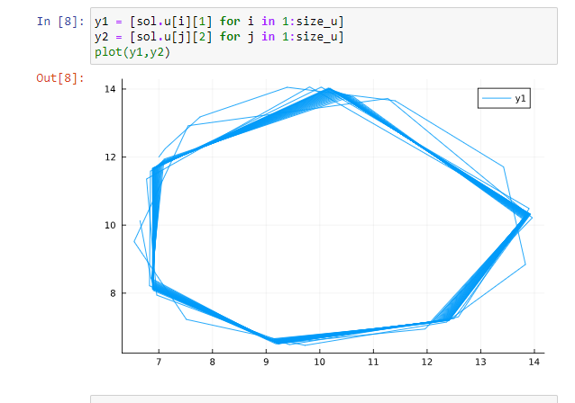
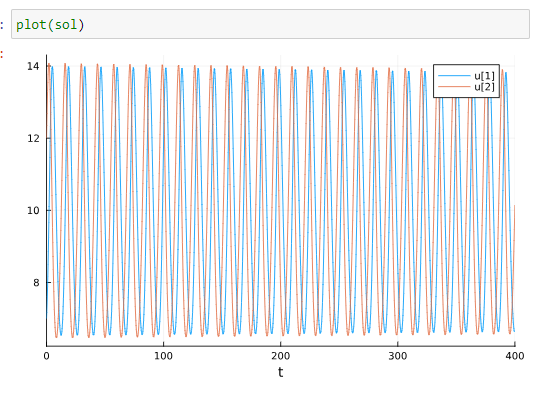
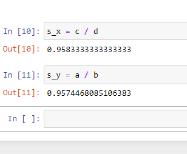

---
## Front matter
lang: ru-RU
title: Презентация лаб 5
subtitle: Лаб 5
author:
  - Аристид Жан Л. А. Н.
institute:
  - Российский университет дружбы народов, Москва, Россия
date: 08 марта 2024

## i18n babel
babel-lang: russian
babel-otherlangs: english

## Formatting pdf
toc: false
toc-title: Содержание
slide_level: 2
aspectratio: 169
section-titles: true
theme: metropolis
header-includes:
 - \metroset{progressbar=frametitle,sectionpage=progressbar,numbering=fraction}
 - '\makeatletter'
 - '\beamer@ignorenonframefalse'
 - '\makeatother'
---

# Информация

## Докладчик

:::::::::::::: {.columns align=center}
::: {.column width="70%"}

  * Аристид Жан Лоэнс Аристобуль
  * Студент
  * Российский университет дружбы народов

:::
::::::::::::::

# Вводная часть

## Цели и задачи

Постройть график зависимости численности хищников от численности жертв,
а также графики изменения численности хищников и численности жертв.

# Результаты

## Разные коэффициенты системы дифференциальных уравнений

Разные коэффициенты системы дифференциальных уравнений где a-коэффициэнт естественной смертости хищников b-коэффициэнт естественной прироста жертв c-коэффициент увлечения числа хищников d-коэффициент смертности жертв (рис. [-@fig:001]).

{#fig:001 width=70%}

## Cистемa дифференциальных уравненийю

Cистемa дифференциальных уравненийю c начальными значение (рис. [-@fig:002]).

{#fig:002 width=70%}

## Первый граф

График зависимости численности хищников от численности жертв (рис. [-@fig:003])

{#fig:003 width=70%}

## Второй граф

Графики изменения численности хищников и численности жертв (рис. [-@fig:004]).

{#fig:004 width=70%}

## Стационарное состояние системы

Стационарное состояние системы (рис. [-@fig:005]).

{#fig:005 width=70%}

# Итоговый слайд

Численность хищников пропорционально изменяется относительно численность жертвов.

 *Спасибо за внимание*
