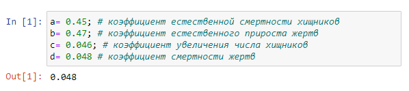
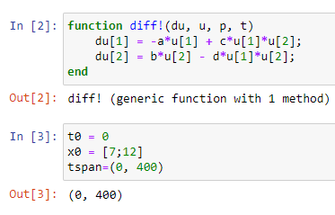
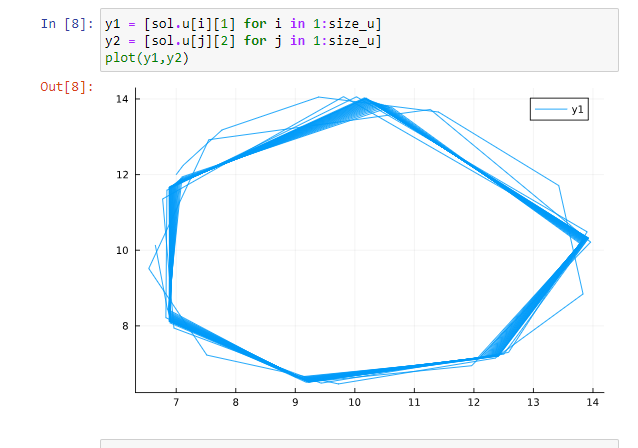
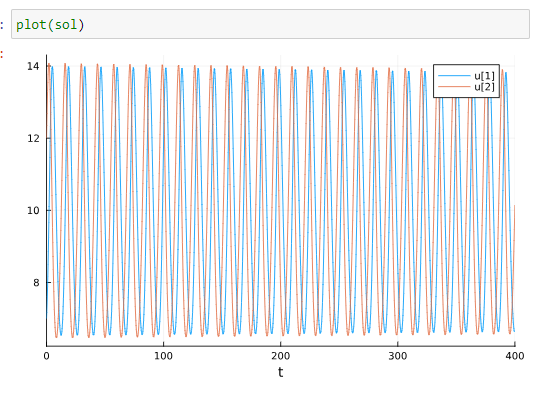
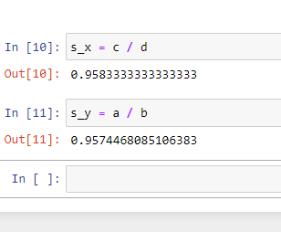

---
## Front matter
title: " Отчёта по лабораторной работе"
subtitle: "Лаб 5"
author: "Аристид Жан Лоэнс Аристобуль"

## Generic otions
lang: ru-RU
toc-title: "Содержание"

## Bibliography
bibliography: bib/cite.bib
csl: pandoc/csl/gost-r-7-0-5-2008-numeric.csl

## Pdf output format
toc: true # Table of contents
toc-depth: 2
lof: true # List of figures
lot: true # List of tables
fontsize: 12pt
linestretch: 1.5
papersize: a4
documentclass: scrreprt
## I18n polyglossia
polyglossia-lang:
  name: russian
  options:
	- spelling=modern
	- babelshorthands=true
polyglossia-otherlangs:
  name: english
## I18n babel
babel-lang: russian
babel-otherlangs: english
## Fonts
mainfont: PT Serif
romanfont: PT Serif
sansfont: PT Sans
monofont: PT Mono
mainfontoptions: Ligatures=TeX
romanfontoptions: Ligatures=TeX
sansfontoptions: Ligatures=TeX,Scale=MatchLowercase
monofontoptions: Scale=MatchLowercase,Scale=0.9
## Biblatex
biblatex: true
biblio-style: "gost-numeric"
biblatexoptions:
  - parentracker=true
  - backend=biber
  - hyperref=auto
  - language=auto
  - autolang=other*
  - citestyle=gost-numeric
## Pandoc-crossref LaTeX customization
figureTitle: "Рис."
tableTitle: "Таблица"
listingTitle: "Листинг"
lofTitle: "Список иллюстраций"
lotTitle: "Список таблиц"
lolTitle: "Листинги"
## Misc options
indent: true
header-includes:
  - \usepackage{indentfirst}
  - \usepackage{float} # keep figures where there are in the text
  - \floatplacement{figure}{H} # keep figures where there are in the text
---

# Цель работы

Постройть график зависимости численности хищников от численности жертв,
а также графики изменения численности хищников и численности жертв.

# Теоретическое введение

Простейшая модель взаимодействия двух видов типа «хищник — жертва» -
модель Лотки-Вольтерры. Данная двувидовая модель основывается на
следующих предположениях:
  1. Численность популяции жертв x и хищников y зависят только от времени (модель не учитывает пространственное распределение популяции незанимаемой территории)
  1. В отсутствии взаимодействия численность видов изменяется по модели Мальтуса, при этом число жертв увеличивается, а число хищников падает
  1. Естественная смертность жертвы и естественная рождаемость хищника считаются несущественными
  1. Эффект насыщения численности обеих популяций не учитывается
  1. Скорость роста численности жертв уменьшается пропорционально численности хищников

# Выполнение лабораторной работы

Разные коэффициенты системы дифференциальных уравнений где a-коэффициэнт естественной смертости хищников b-коэффициэнт естественной прироста жертв c-коэффициент увлечения числа хищников d-коэффициент смертности жертв (рис. [-@fig:001]).

{#fig:001 width=70%}

Cистемa дифференциальных уравненийю c начальными значение (рис. [-@fig:002]).

{#fig:002 width=70%}

График зависимости численности хищников от численности жертв (рис. [-@fig:003])

{#fig:003 width=70%}

Графики изменения численности хищников и численности жертв (рис. [-@fig:004]).

{#fig:004 width=70%}

Стационарное состояние системы (рис. [-@fig:005]).

{#fig:005 width=70%}

# Выводы

Численность хищников пропорционально изменяется относительно численность жертвов.

# Список литературы{.unnumbered}

Volterra, V. (1931). "Variations and fluctuations of the number of individuals in animal species living together". In Chapman, R. N. (ed.). Animal Ecology. McGraw–Hill.
