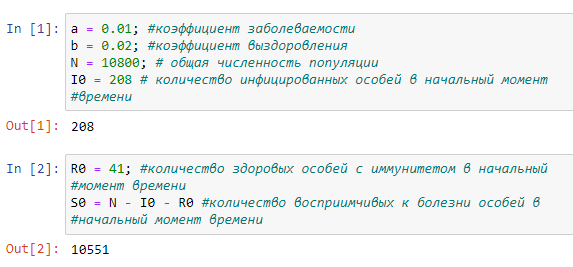
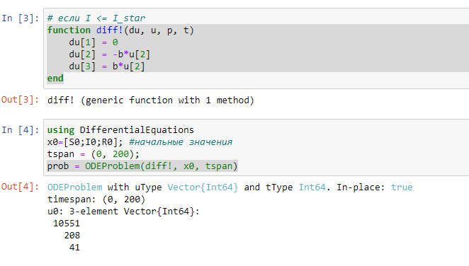
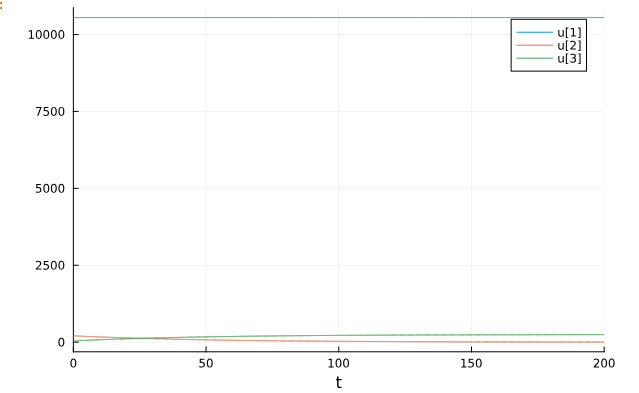
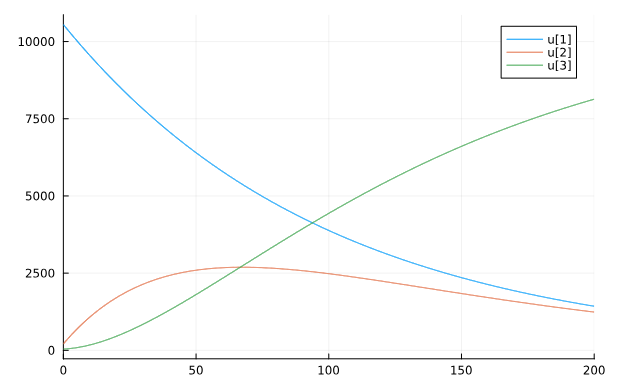

---
## Front matter
lang: ru-RU
title: Презентация Лаб 6
subtitle: Лаб 6
author:
  - Аристиж Ж. Л. А. Н.
institute:
  - Российский университет дружбы народов, Москва, Россия
date: 17 марта 2024

## i18n babel
babel-lang: russian
babel-otherlangs: english

## Formatting pdf
toc: false
toc-title: Содержание
slide_level: 2
aspectratio: 169
section-titles: true
theme: metropolis
header-includes:
 - \metroset{progressbar=frametitle,sectionpage=progressbar,numbering=fraction}
 - '\makeatletter'
 - '\beamer@ignorenonframefalse'
 - '\makeatother'
---

# Информация

## Докладчик

:::::::::::::: {.columns align=center}
::: {.column width="70%"}

  * Аристид Жан Л. А. Н.
  * Студент
  * Российский университет дружбы народов

:::
::::::::::::::

# Вводная часть

## Объект и предмет исследования

- Протекание Эпидемия

## Цели и задачи

- Моделиризовать протекания эпидемия.
- Постройте графики изменения числа особей
   - если I(t) <= I_star
   - если I(t) > I_star

# Результаты

##  Началные условие и коэффициенты

Через a и b обозначим коэффициент заболеваемости и выздоровления соотвественно. Через N, I0, R0 и S0 обозначим общая численность популяции, количество инфицированных особей в начальный момент времени, количество здоровых особей с иммунитетом в начальный момент времени и количество восприимчивых к болезни особей в начальный момент времени (рис. [-@fig:001]).

{#fig:001 width=70%}

## Первая Система дифференциальная уравнений

Эта система дифференциальная уравнений представляет случай когда I(0) <= I_star (рис. [-@fig:002]).

{#fig:002 width=70%}

## Первый график

Это график представляет случай когда I(0) <= I_star (рис. [-@fig:003]).

{#fig:003 width=70%}

## Вторая Система дифференциальная уравнений

Эта система дифференциальная уравнений представляет случай когда I(0) > I_star (рис. [-@fig:004]).

[Вторая Система дифференциальная уравнений](image/img04.png){#fig:004 width=70%}

## Второй график

Это график представляет случай когда I(0) > I_star (рис. [-@fig:005]).

{#fig:005 width=70%}

# Заключение

В первом случае количество восприимчивых к болезни особей в начальный момент времени постоянно, изменения количество здоровых особей с иммунитетом в начальный момент времени и изменения количества инфицированных особей в начальный момент времени обратно пропорциональные. Зато в втором случае количество восприимчивых к болезни особей в начальный момент времени и изменения количество здоровых особей с иммунитетом обратно пропорциональные.