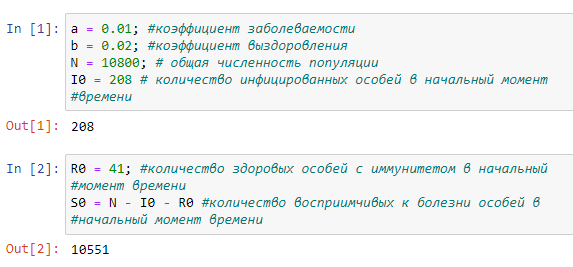
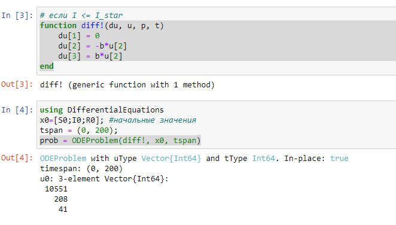
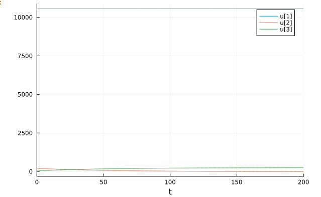
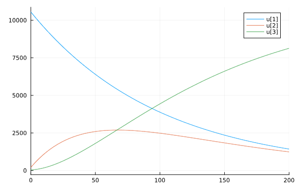

---
## Front matter
title: "Отчёт по лабораторной работе"
subtitle: "Лаб 6"
author: "Аристид Жан Лоэнс Аристобуль Надаль"

## Generic otions
lang: ru-RU
toc-title: "Содержание"

## Bibliography
bibliography: bib/cite.bib
csl: pandoc/csl/gost-r-7-0-5-2008-numeric.csl

## Pdf output format
toc: true # Table of contents
toc-depth: 2
lof: true # List of figures
lot: true # List of tables
fontsize: 12pt
linestretch: 1.5
papersize: a4
documentclass: scrreprt
## I18n polyglossia
polyglossia-lang:
  name: russian
  options:
	- spelling=modern
	- babelshorthands=true
polyglossia-otherlangs:
  name: english
## I18n babel
babel-lang: russian
babel-otherlangs: english
## Fonts
mainfont: PT Serif
romanfont: PT Serif
sansfont: PT Sans
monofont: PT Mono
mainfontoptions: Ligatures=TeX
romanfontoptions: Ligatures=TeX
sansfontoptions: Ligatures=TeX,Scale=MatchLowercase
monofontoptions: Scale=MatchLowercase,Scale=0.9
## Biblatex
biblatex: true
biblio-style: "gost-numeric"
biblatexoptions:
  - parentracker=true
  - backend=biber
  - hyperref=auto
  - language=auto
  - autolang=other*
  - citestyle=gost-numeric
## Pandoc-crossref LaTeX customization
figureTitle: "Рис."
tableTitle: "Таблица"
listingTitle: "Листинг"
lofTitle: "Список иллюстраций"
lotTitle: "Список таблиц"
lolTitle: "Листинги"
## Misc options
indent: true
header-includes:
  - \usepackage{indentfirst}
  - \usepackage{float} # keep figures where there are in the text
  - \floatplacement{figure}{H} # keep figures where there are in the text
---

# Цель работы

Моделиризовать протекания эпидемия.

# Задание

На одном острове вспыхнула эпидемия. Известно, что из всех проживающих
на острове (N=10 800) в момент начала эпидемии (t=0) число заболевших людей
(являющихся распространителями инфекции) I(0)=208, А число здоровых людей с
иммунитетом к болезни R(0)=41. Таким образом, число людей восприимчивых к
болезни, но пока здоровых, в начальный момент времени S(0)=N-I(0)- R(0).
Постройте графики изменения числа особей в каждой из трех групп.
Рассмотрите, как будет протекать эпидемия в случае:
1) если I(t) <= I_star
2) если I(t) > I_star

# Теоретическое введение

Рассмотрим простейшую модель эпидемии. Предположим, что некая
популяция, состоящая из N особей, (считаем, что популяция изолирована)
подразделяется на три группы. Первая группа - это восприимчивые к болезни, но
пока здоровые особи, обозначим их через S(t). Вторая группа – это число
инфицированных особей, которые также при этом являются распространителями
инфекции, обозначим их I(t). А третья группа, обозначающаяся через R(t) – это
здоровые особи с иммунитетом к болезни.
[@epidemic:bash]

# Выполнение лабораторной работы

Через a и b обозначим коэффициент заболеваемости и выздоровления соотвественно. Через N, I0, R0 и S0 обозначим общая численность популяции, количество инфицированных особей в начальный момент времени, количество здоровых особей с иммунитетом в начальный момент времени и количество восприимчивых к болезни особей в начальный момент времени (рис. [-@fig:001]).

{#fig:001 width=70%}

Эта система дифференциальная уравнений представляет случай когда I(0) <= I_star (рис. [-@fig:002]).

{#fig:002 width=70%}

Это график представляет случай когда I(0) <= I_star (рис. [-@fig:003]).

{#fig:003 width=70%}

Эта система дифференциальная уравнений представляет случай когда I(0) > I_star (рис. [-@fig:004]).

[Вторая Система дифференциальная уравнений](image/img04.png){#fig:004 width=70%}

Это график представляет случай когда I(0) > I_star (рис. [-@fig:005]).

{#fig:005 width=70%}

# Выводы

В первом случае количество восприимчивых к болезни особей в начальный момент времени постоянно, изменения количество здоровых особей с иммунитетом в начальный момент времени и изменения количества инфицированных особей в начальный момент времени обратно пропорциональные. Зато в втором случае количество восприимчивых к болезни особей в начальный момент времени и изменения количество здоровых особей с иммунитетом обратно пропорциональные.

# Список литературы{.unnumbered}

::: {#refs}
:::
