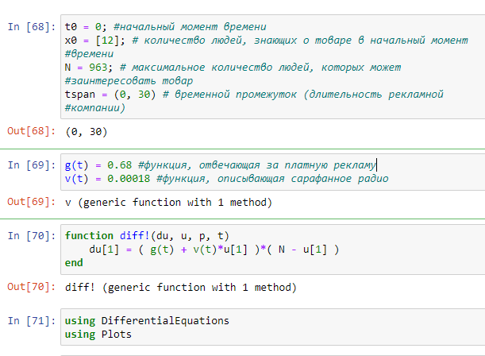
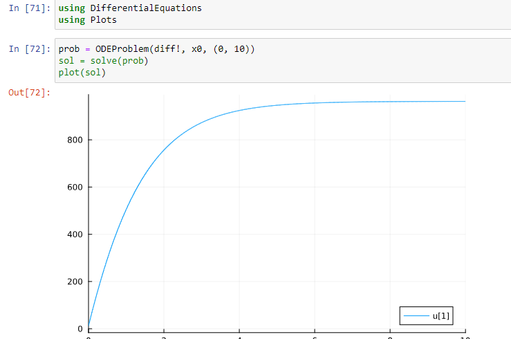
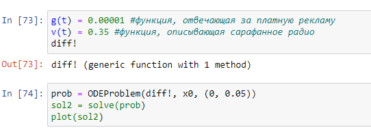
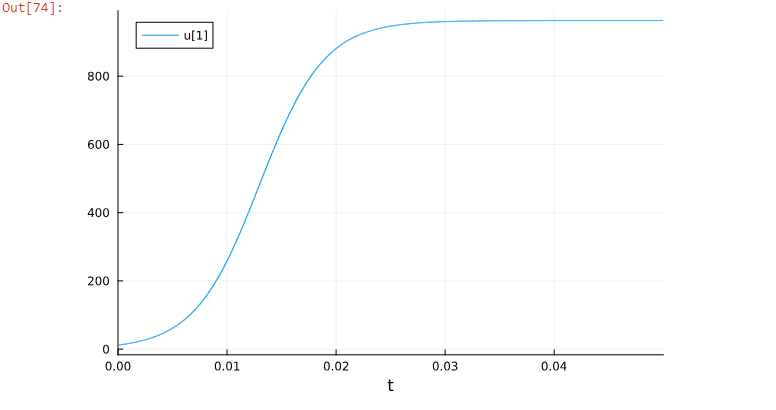
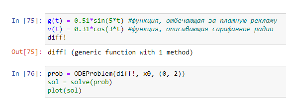
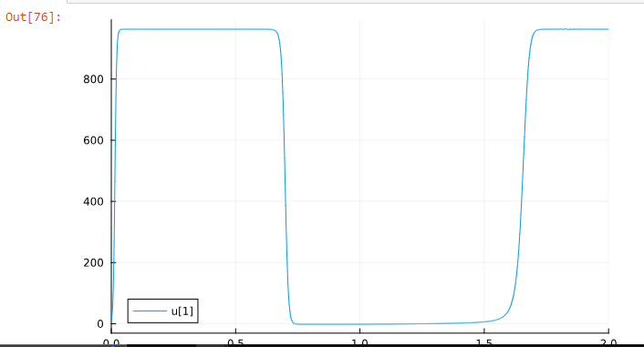
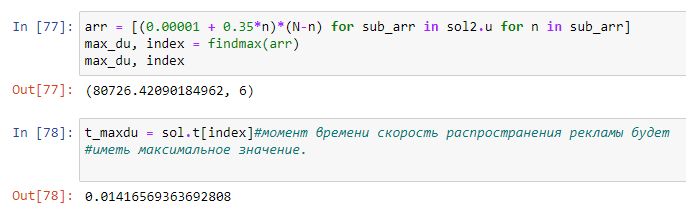

---
## Front matter
lang: ru-RU
title: Presentation 7
subtitle: Lab 7
author:
  - Aristide Jean Loens A.
institute:
  - RUDN
date: 23 March 2024

## i18n babel
babel-lang: russian
babel-otherlangs: english

## Formatting pdf
toc: false
toc-title: Содержание
slide_level: 2
aspectratio: 169
section-titles: true
theme: metropolis
header-includes:
 - \metroset{progressbar=frametitle,sectionpage=progressbar,numbering=fraction}
 - '\makeatletter'
 - '\beamer@ignorenonframefalse'
 - '\makeatother'
---

# Информация

## Докладчик

:::::::::::::: {.columns align=center}
::: {.column width="70%"}

  * Aristide Jean Loens A.
  * Student 
  * RUDN
  

:::
::::::::::::::

# Introduction

## Goal

Build an advertising distribution schedule

## Task

Construct a graph of the distribution of advertising, the mathematical model of which is described
with the following equation:
1. dn/dt= (0.68 + 0.00018n(t))(N-n(t))
2. dn/dt= (0.00001 + 0.35n(t))(N-n(t))
3. dn/dt= (0.51sin(5t) + 0.31cos(3t)n(t))(N-n(t))
At the same time, the audience size is N=963, at the initial moment 12 people know about the product. For
case 2, determine at what point in time the speed of advertising distribution will be
have the maximum value.

## Theory Aspects

An advertising campaign for a new product or service is being organized. Necessary,
so that future sales profits more than cover advertising costs.
At first, costs may exceed profits because only a small part
potential buyers will be informed about the new product. Then, when
As the number of sales increases, profits also increase, and finally the moment will come,
when the market becomes saturated and advertising the product becomes useless.

# Results

## First Case

{width=70%}

## Graph
{width=70%}

## Second Case
{width=70%}

## Graph
{width=70%}

## Third case

{ width=70%}

## Graph

{width=70%}

## Max speed propagation and time

{width=70%}

## Final Slide 

When the function describing word of mouth is much larger than the function responsible for paid advertising, the number of people aware of the product increases quickly.

