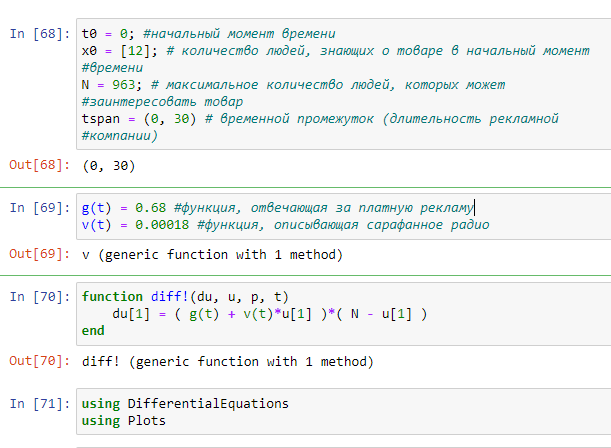
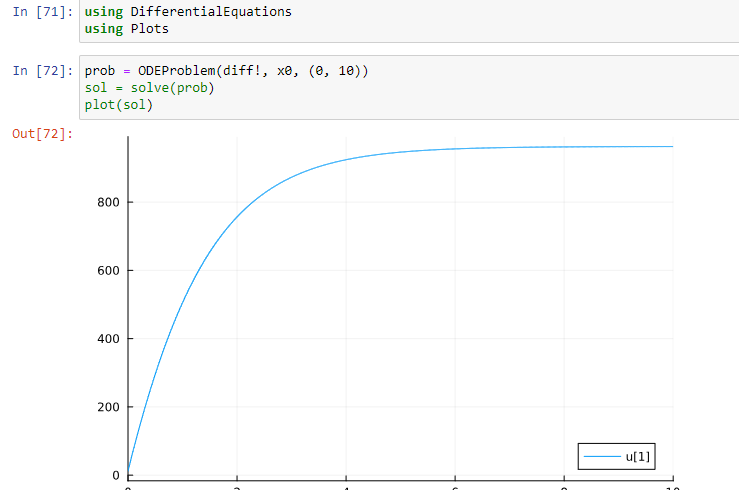
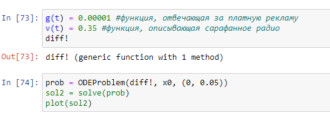
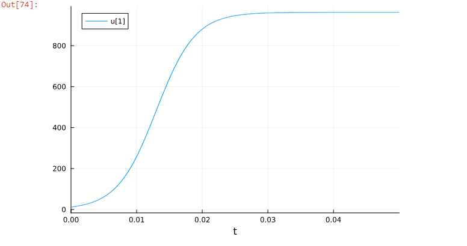
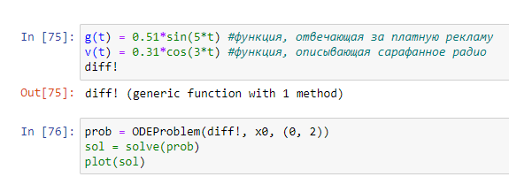
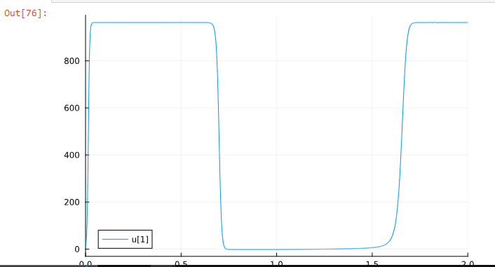
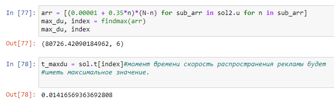

---
## Front matter
title: "Отчёта по лабораторной работе"
subtitle: "Лаб 7"
author: "Аристид Жан Лоэнс Аристобуль Надаль"

## Generic otions
lang: ru-RU
toc-title: "Содержание"

## Bibliography
bibliography: bib/cite.bib
csl: pandoc/csl/gost-r-7-0-5-2008-numeric.csl

## Pdf output format
toc: true # Table of contents
toc-depth: 2
lof: true # List of figures
lot: true # List of tables
fontsize: 12pt
linestretch: 1.5
papersize: a4
documentclass: scrreprt
## I18n polyglossia
polyglossia-lang:
  name: russian
  options:
	- spelling=modern
	- babelshorthands=true
polyglossia-otherlangs:
  name: english
## I18n babel
babel-lang: russian
babel-otherlangs: english
## Fonts
mainfont: PT Serif
romanfont: PT Serif
sansfont: PT Sans
monofont: PT Mono
mainfontoptions: Ligatures=TeX
romanfontoptions: Ligatures=TeX
sansfontoptions: Ligatures=TeX,Scale=MatchLowercase
monofontoptions: Scale=MatchLowercase,Scale=0.9
## Biblatex
biblatex: true
biblio-style: "gost-numeric"
biblatexoptions:
  - parentracker=true
  - backend=biber
  - hyperref=auto
  - language=auto
  - autolang=other*
  - citestyle=gost-numeric
## Pandoc-crossref LaTeX customization
figureTitle: "Рис."
tableTitle: "Таблица"
listingTitle: "Листинг"
lofTitle: "Список иллюстраций"
lotTitle: "Список таблиц"
lolTitle: "Листинги"
## Misc options
indent: true
header-includes:
  - \usepackage{indentfirst}
  - \usepackage{float} # keep figures where there are in the text
  - \floatplacement{figure}{H} # keep figures where there are in the text
---

# Цель работы

Построить график распространения рекламы

# Задание

Постройте график распространения рекламы, математическая модель которой описывается
следующим уравнением:
1. dn/dt= (0.68 + 0.00018n(t))(N-n(t))
2. dn/dt= (0.00001 + 0.35n(t))(N-n(t))
3. dn/dt= (0.51sin(5t) + 0.31cos(3t)n(t))(N-n(t))
При этом объем аудитории N=963, в начальный момент о товаре знает 12 человек. Для
случая 2 определите в какой момент времени скорость распространения рекламы будет
иметь максимальное значение.

# Теоретическое введение

Организуется рекламная кампания нового товара или услуги. Необходимо,
чтобы прибыль будущих продаж с избытком покрывала издержки на рекламу.
Вначале расходы могут превышать прибыль, поскольку лишь малая часть
потенциальных покупателей будет информирована о новинке. Затем, при
увеличении числа продаж, возрастает и прибыль, и, наконец, наступит момент,
когда рынок насытиться, и рекламировать товар станет бесполезным.
[@publicity_en].

# Выполнение лабораторной работы

Через t0, x0, N, tspan, g(t), v(t), обозначим #начальный момент времени, количество людей, знающих о товаре в начальный момент времени, максимальное количество людей, которых может заинтересовать товар, временной промежуток (длительность рекламной компании), функция, отвечающая за платную рекламу, функция, описывающая сарафанное радио соотвествинно.  (рис. [-@fig:001]).

{#fig:001 width=70%}

Граф представляет первый случай (рис. [-@fig:002]).

{#fig:002 width=70%}

функция, отвечающая за платную рекламу, функция, описывающая сарафанное радио для второго случай (рис. [-@fig:003]).

{#fig:003 width=70%}

Граф представляет второй случай (рис. [-@fig:004]).

{#fig:004 width=70%}

функция, отвечающая за платную рекламу, функция, описывающая сарафанное радио для третьего случай (рис. [-@fig:005]).

{#fig:005 width=70%}

Граф представляет третий случай (рис. [-@fig:006]).

{#fig:006 width=70%}

момент времени скорость распространения рекламы будет иметь максимальное значение. (рис. [-@fig:007]).

{#fig:007 width=70%}

# Выводы

Когда функция, описывающая сарафанное радио гороздо больше чем функция, отвечающая за платную рекламу количество людей, знающих о товаре увеличивается быстро.

# Список литературы{.unnumbered}

::: {#refs}
:::
