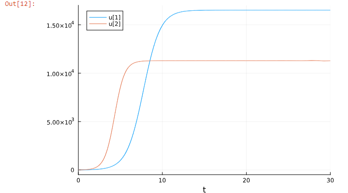
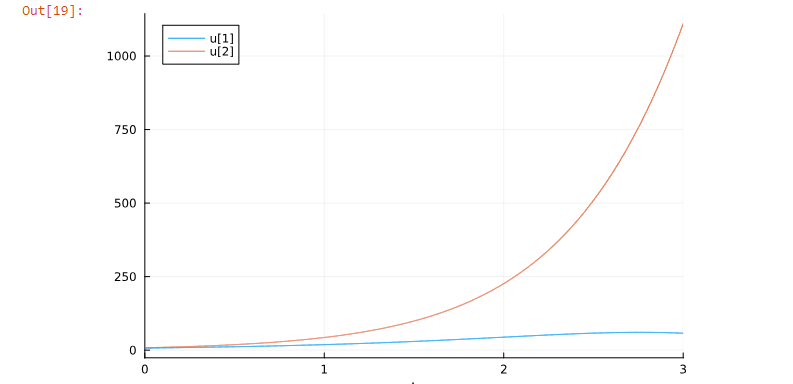

---
## Front matter
lang: ru-RU
title: Презентация лаб 8
subtitle: Модель конкуренции двух фирм
author:
  - Аристид Жан Лоэнс
institute:
  - Российский университет дружбы народов, Москва, Россия
date: 30 марта 2024

## i18n babel
babel-lang: russian
babel-otherlangs: english

## Formatting pdf
toc: false
toc-title: Содержание
slide_level: 2
aspectratio: 169
section-titles: true
theme: metropolis
header-includes:
 - \metroset{progressbar=frametitle,sectionpage=progressbar,numbering=fraction}
 - '\makeatletter'
 - '\beamer@ignorenonframefalse'
 - '\makeatother'
---

# Информация

## Докладчик

:::::::::::::: {.columns align=center}
::: {.column width="70%"}

  * Аристид Жан Лоэнс Аристобуль Н.
  * Студент
  * Российский университет дружбы народов

:::
::::::::::::::

# Актуальность

- Модель конкуренции двух фирм.
- Модель одной фирмы
- Конкуренция двух фирм

## Цели и задачи

- Постройте графики изменения оборотных средств фирмы 1 и фирмы 2 без учета постоянных издержек

# Результаты

## Первый случай

$$
\begin{cases}
  \frac{dM_{1}}{d\theta} = M_{1} -\frac{b}{c_{1}}M_{1}M_{2}-\frac{a_{1}}{c_{1}}M_{1}^{2} 
  \\
  \frac{dM_{2}}{d\theta} = \frac{c_{2}}{c_{1}}M_{2} -\frac{b}{c_{1}}M_{1}M_{2}-\frac{a_{2}}{c_{1}}M_{2}^{2}
\end{cases}
$$

Графики для первого случай (рис. [-@fig:004]).

{#fig:004 width=70%}

## Второй случай

$$
\begin{cases}
  \frac{dM_{1}}{d\theta} = M_{1} -(\frac{b}{c_{1}}+0.0013)M_{1}M_{2}-\frac{a_{1}}{c_{1}}M_{1}^{2} 
  \\
  \frac{dM_{2}}{d\theta} = \frac{c_{2}}{c_{1}}M_{2} -\frac{b}{c_{1}}M_{1}M_{2}-\frac{a_{2}}{c_{1}}M_{2}^{2}
\end{cases}
$$

Графики для второго случай (рис. [-@fig:006]).

{#fig:006 width=70%}

## Итоговый слайд

- Во втором случае ошеломляющий прогресс второй фирмы, представленной красным, привел к банкротству фирмы, представленной синим.
*Спасибо за внимание*

