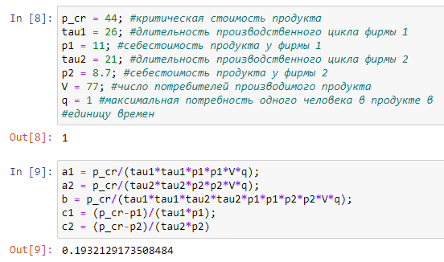
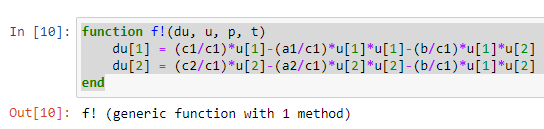
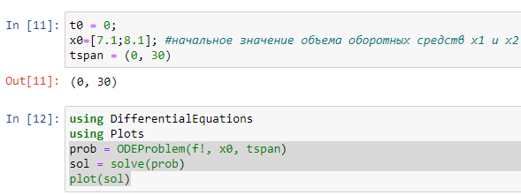
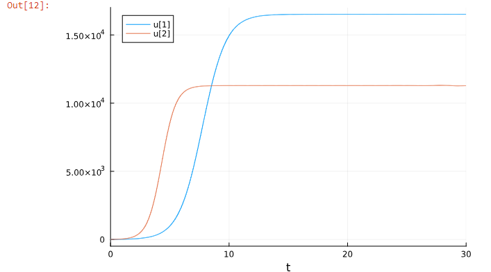
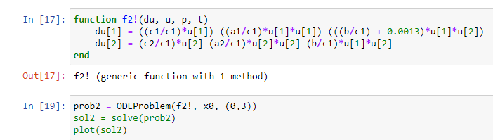
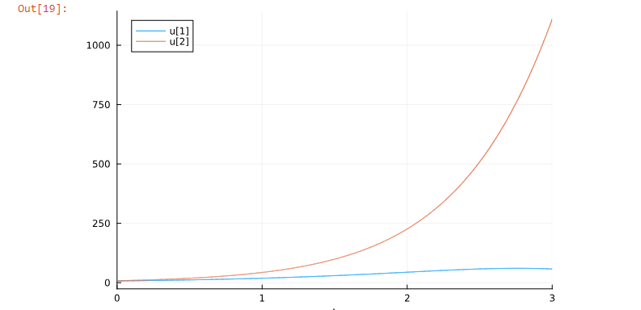

---
## Front matter
title: "Отчёт по лабораторной работе"
subtitle: "Лаб 8"
author: "Аристид Жан Лоэнс А. Н."

## Generic otions
lang: ru-RU
toc-title: "Содержание"

## Bibliography
bibliography: bib/cite.bib
csl: pandoc/csl/gost-r-7-0-5-2008-numeric.csl

## Pdf output format
toc: true # Table of contents
toc-depth: 2
lof: true # List of figures
lot: true # List of tables
fontsize: 12pt
linestretch: 1.5
papersize: a4
documentclass: scrreprt
## I18n polyglossia
polyglossia-lang:
  name: russian
  options:
	- spelling=modern
	- babelshorthands=true
polyglossia-otherlangs:
  name: english
## I18n babel
babel-lang: russian
babel-otherlangs: english
## Fonts
mainfont: PT Serif
romanfont: PT Serif
sansfont: PT Sans
monofont: PT Mono
mainfontoptions: Ligatures=TeX
romanfontoptions: Ligatures=TeX
sansfontoptions: Ligatures=TeX,Scale=MatchLowercase
monofontoptions: Scale=MatchLowercase,Scale=0.9
## Biblatex
biblatex: true
biblio-style: "gost-numeric"
biblatexoptions:
  - parentracker=true
  - backend=biber
  - hyperref=auto
  - language=auto
  - autolang=other*
  - citestyle=gost-numeric
## Pandoc-crossref LaTeX customization
figureTitle: "Рис."
tableTitle: "Таблица"
listingTitle: "Листинг"
lofTitle: "Список иллюстраций"
lotTitle: "Список таблиц"
lolTitle: "Листинги"
## Misc options
indent: true
header-includes:
  - \usepackage{indentfirst}
  - \usepackage{float} # keep figures where there are in the text
  - \floatplacement{figure}{H} # keep figures where there are in the text
---

# Цель работы

Постройте графики изменения оборотных средств фирмы 1 и фирмы 2 без учета постоянных издержек.

# Задание

Вариант 22
Случай 1. Рассмотрим две фирмы, производящие взаимозаменяемые товары одинакового качества и находящиеся в одной рыночной нише. Считаем, что в рамках нашей модели конкурентная борьба ведётся только рыночными методами. То есть, конкуренты могут влиять на противника путем изменения параметров своего производства: себестоимость, время цикла, но не могут прямо вмешиваться в ситуацию на рынке («назначать» цену или влиять на потребителей каким-либо иным способом.) Будем считать, что постоянные издержки пренебрежимо малы, и в модели учитывать не будем. В этом случае динамика изменения объемов продаж фирмы 1 и фирмы 2 описывается следующей системой уравнений:
$$
\begin{cases}
  \frac{dM_{1}}{d\theta} = M_{1} -\frac{b}{c_{1}}M_{1}M_{2}-\frac{a_{1}}{c_{1}}M_{1}^{2} 
  \\
  \frac{dM_{2}}{d\theta} = \frac{c_{2}}{c_{1}}M_{2} -\frac{b}{c_{1}}M_{1}M_{2}-\frac{a_{2}}{c_{1}}M_{2}^{2}
\end{cases}
$$
Случай 2. Рассмотрим модель, когда, помимо экономического фактора влияния (изменение себестоимости, производственного цикла, использование кредита и т.п.), используются еще и социально-психологические факторы – формирование общественного предпочтения одного товара другому, не зависимо от их качества и цены. В этом случае взаимодействие двух фирм будет зависеть друг от друга, соответственно коэффициент перед M M1 2 будет отличаться. Пусть в рамках рассматриваемой модели динамика изменения объемов продаж фирмы 1 и фирмы 2 описывается следующей системой уравнений:
$$
\begin{cases}
  \frac{dM_{1}}{d\theta} = M_{1} -(\frac{b}{c_{1}}+0.0013)M_{1}M_{2}-\frac{a_{1}}{c_{1}}M_{1}^{2} 
  \\
  \frac{dM_{2}}{d\theta} = \frac{c_{2}}{c_{1}}M_{2} -\frac{b}{c_{1}}M_{1}M_{2}-\frac{a_{2}}{c_{1}}M_{2}^{2}
\end{cases}
$$
Для обоих случаев рассмотрим задачу со следующими начальными условиями и параметрами:
M1 = 7.1, M2=8.1,
p_cr = 44, N=77, q=1
tau1 = 26, tau2 = 21,
p1 = 11, p2= 8.7

Замечание: Значения p_cr p1,2 N указаны в тысячах единиц, а значения M1,2 указаны в млн. единиц.
Обозначения:
N – число потребителей производимого продукта.
τ – длительность производственного цикла
p – рыночная цена товара
p̃– себестоимость продукта, то есть переменные издержки на производство единицы продукции.
q – максимальная потребность одного человека в продукте в единицу времени
theta = t/c1 - безразмерное время
1. Постройте графики изменения оборотных средств фирмы 1 и фирмы 2 без учета постоянных издержек и с веденной нормировкой для случая 1.
2. Постройте графики изменения оборотных средств фирмы 1 и фирмы 2 без учета постоянных издержек и с веденной нормировкой для случая 2

# Теоретическое введение
Для построения модели конкуренции хотя бы двух фирм необходимо рассмотреть модель одной фирмы. Вначале рассмотрим модель фирмы, производящей продукт долговременного пользования, когда цена его определяется балансом спроса и предложения. Примем, что этот продукт занимает определенную нишу рынка и конкуренты в ней отсутствуют.
Обозначим:
N – число потребителей производимого продукта.
S – доходы потребителей данного продукта. Считаем, что доходы всех
потребителей одинаковы. Это предположение справедливо, если речь идет об одной рыночной нише, т.е. производимый продукт ориентирован на определенный слой населения.
M – оборотные средства предприятия
τ – длительность производственного цикла
p – рыночная цена товара
p̃ – себестоимость продукта, то есть переменные издержки на производство единицы продукции.
δ – доля оборотных средств, идущая на покрытие переменных издержек.
κ – постоянные издержки, которые не зависят от количества выпускаемой продукции.
 [@conflict-model_en].

# Выполнение лабораторной работы

Через p_cr, tau1, p1, tau2, p2, V, 1 обозначим критическую стоимость продукта, длительность производственного цикла фирмы 1, себестоимость продукта у фирмы 1, длительность производственного цикла фирмы 2, себестоимость продукта у фирмы 2, число потребителей производимого продукта, максимальная потребность одного человека в продукте в единицу времен соотвественно (рис. [-@fig:001]).

{#fig:001 width=70%}

Система дифф урав. первого случай. (рис. [-@fig:002]).

{#fig:002 width=70%}

Вычисляем дифф уравнении с помощью библиотеки DifferentialEquations (рис. [-@fig:003]).

{#fig:003 width=70%}

Графики для первого случай (рис. [-@fig:004]).

{#fig:004 width=70%}

Система Дифф уравнение для второго случая (рис. [-@fig:005]).

{#fig:005 width=70%}

Графики для второго случай (рис. [-@fig:006]).

{#fig:006 width=70%}

# Выводы

Во втором случае ошеломляющий прогресс второй фирмы, представленной красным, привел к банкротству фирмы, представленной синим.

# Список литературы{.unnumbered}

::: {#refs}
:::
